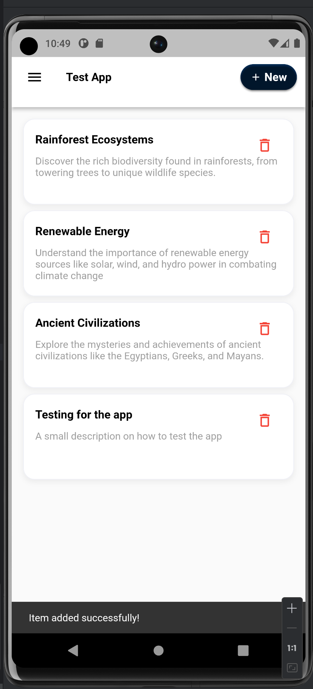
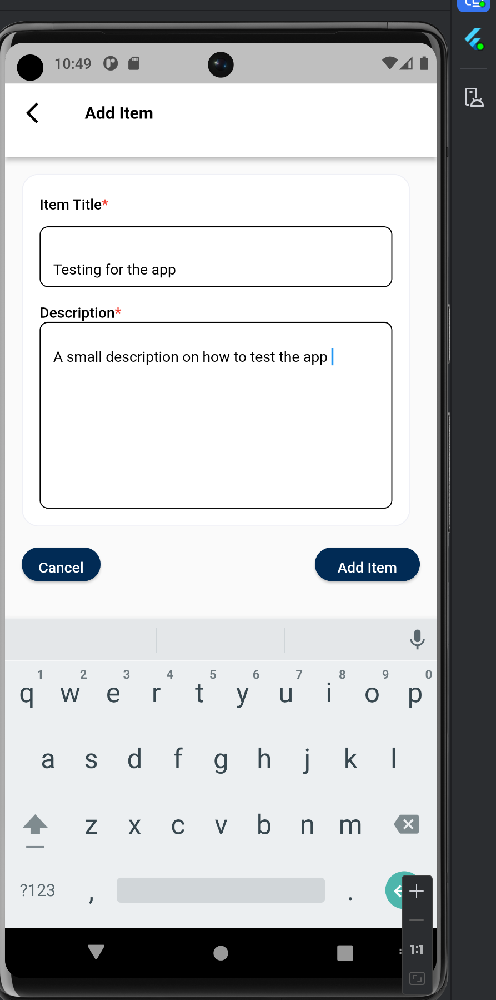
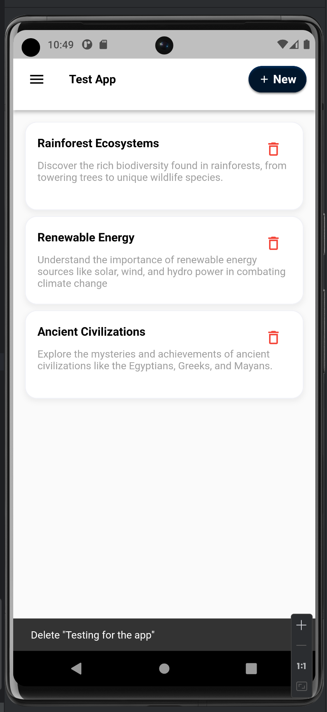

# testapp

A new Flutter project.

# Flutter Interview Test.

## Android Developer Pre-screening test

## Achievments
• Create a mobile app that displays a list of items.
• Each item should have a title and description.
• Implement a feature to add new items to the list via a form.
• Implement a feature to delete items from the list.
• The app should be responsive and work well on both iOS and Android.

## Technologies used
- Shared preferences to store the database

## Setting up the project
- Git clone [Github](https://github.com/collins-swai/FE-Assignment)
- Download android studio
- Run flutter pub get to get the dependancies

## Screenshoots 
- Projects starts from the home screen
  | Home screen                                                                                                                       | Items screen                                                                                                                         |           Delete Screen                                                                                                          |
  | ------------------------------------------------------------------------------------------------------------------------------------ | ------------------------------------------------------------------------------------------------------------------------------------ | ------------------------------------------------------------------------------------------------------------------------------------ |
  |  |  | 

